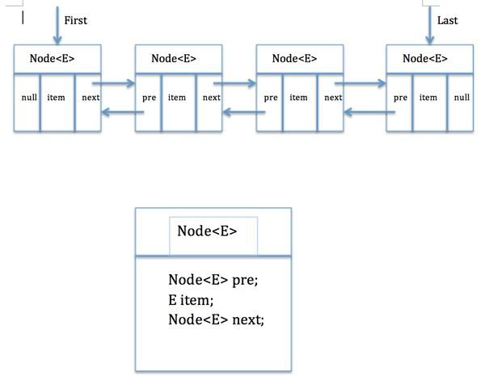

[toc]

## LinkedList 源码分析

### 简介

1.  LinkedList是一个实现了List接口和Deque接口的双端链表。

2.  LinkedList不是线程安全的，如果想使LinkedList变成线程安全的，可以调用静态类Collections类中的synchronizedList方法：

    -   ```java
        List list=Collections.synchronizedList(new LinkedList(...));
        ```

    -   

### 数据结构

1.  图示

    -   

2.  Node 类

    ```java
        private static class Node<E> {
            
            E item;	// 节点值
            Node<E> next;	// 后继
            Node<E> prev;	// 前驱
    
            Node(Node<E> prev, E element, Node<E> next) {
                this.item = element;
                this.next = next;
                this.prev = prev;
            }
        }
    ```

    

### 源代码

1.  构造方法

    -   ```java
            /**
             * 空构造
             */
        	public LinkedList() {
            }
        	
            /**
             * 使用已有集合，构造新链表
             */
            public LinkedList(Collection<? extends E> c) {
                this();
                addAll(c);
            }
        ```

2.  **addAll(Collection<? extends E> c) 方法**

    -   ```java
            /**
             * 将指定集合添加到链表尾部
             */
            public boolean addAll(Collection<? extends E> c) {
                return addAll(size, c);
            }
        
            public boolean addAll(int index, Collection<? extends E> c) {
                // 检查索引（index >= 0 && index <= size）
                checkPositionIndex(index);
                
        		// 集合转数组，得到变量 a
                Object[] a = c.toArray();
                // 如果指定集合为空，则返回 false
                int numNew = a.length;
                if (numNew == 0)
                    return false;
        		
                // 获取前驱和后继节点
                Node<E> pred, succ;
                // 如果 index == size（尾部插入），前驱为 last 节点，后继为 null
                if (index == size) {
                    succ = null;
                    pred = last;
                } else {
                    // 否则，使用 node 方法查找后继节点 succ，前驱为 succ.perv
                    succ = node(index);
                    pred = succ.prev;
                }
        		
                // 遍历插入
                for (Object o : a) {
                    @SuppressWarnings("unchecked") E e = (E) o;
                    // 创建新节点，前驱指向 pred
                    Node<E> newNode = new Node<>(pred, e, null);
                    
                    if (pred == null)
                        // 如果是插入链头
                        first = newNode;
                    else
                        // pred 后继指向新节点
                        pred.next = newNode;
                    // 更新 pred，指向新节点
                    pred = newNode;
                }
        		
                // 如果是插入链尾
                if (succ == null) {
                    last = pred;
                } else {
                    // 否则，将新链表与先前链表连接起来
                    pred.next = succ;
                    succ.prev = pred;
                }
        
                size += numNew;
                modCount++;
                return true;
            }
        ```

3.  Node<E> node(int index) 方法

    -   ```java
            /**
             * 返回指定索引处的元素
             */
        	Node<E> node(int index) {
                // assert isElementIndex(index);
        		
                // 如果 index 小于 size 的一半，从头部开始遍历
                if (index < (size >> 1)) {
                    Node<E> x = first;
                    for (int i = 0; i < index; i++)
                        x = x.next;
                    return x;
                } else {
                    // 否则，从尾部开始遍历
                    Node<E> x = last;
                    for (int i = size - 1; i > index; i--)
                        x = x.prev;
                    return x;
                }
            }
        ```

4.  **public boolean add(E e) 方法**

    -   ```java
            /**
             * 添加指定元素到链表尾部
             */
            public boolean add(E e) {
                linkLast(e);
                return true;
            }
        ```

5.  void linkLast(E e) 方法

    -   ```java
            /**
             * 链接一个尾部元素
             */
            void linkLast(E e) {
                final Node<E> l = last;
                final Node<E> newNode = new Node<>(l, e, null);
                // 修改 last 指针
                last = newNode;
                // last 为 null，表示链表为空
                if (l == null)
                    first = newNode;
                else
                    // 后继指针指向新节点
                    l.next = newNode;
                size++;
                modCount++;
            }
        ```

6.  **public void add(int index, E element) 方法**

    -   ```java
            /**
             * 插入指定元素到指定位置
             */
            public void add(int index, E element) {
                // check: index >= 0 && index <= size;
                checkPositionIndex(index);
        		// 添加到链尾
                if (index == size)
                    linkLast(element);
                else
                    // 添加到链中
                    linkBefore(element, node(index));
            }
        ```

7.  void linkBefore(E e, Node<E> succ) 方法

    -   ```java
            /**
             * 添加元素 e 到 succ（succ != null） 前
             */
            void linkBefore(E e, Node<E> succ) {
                // assert succ != null;
                final Node<E> pred = succ.prev;
                final Node<E> newNode = new Node<>(pred, e, succ);
                succ.prev = newNode;
                // 如果 succ 为 头节点
                if (pred == null)
                    // 修改 first 指针
                    first = newNode;
                else
                    // pred 后继指针
                    pred.next = newNode;
                size++;
                modCount++;
            }
        ```

8.  **public void addFirst(E e) 方法**

    -   ```java
             /**
             * 添加指定元素到链头
             *
             * @param e the element to add
             */
            public void addFirst(E e) {
                linkFirst(e);
            }
        
            private void linkFirst(E e) {
                final Node<E> f = first;
                final Node<E> newNode = new Node<>(null, e, f);
                // 修改 first 指针
                first = newNode;
                if (f == null)
                    // 链表为空
                    last = newNode;
                else
                    f.prev = newNode;
                size++;
                modCount++;
            }
        ```

9.  **public void addLast(E e) 方法**

    -   ```java
            /**
             * 添加指定元素到尾节点
             */
            public void addLast(E e) {
                linkLast(e);
            }
        ```

10.  **public E get(int index) 方法**，获取指定索引元素

     -   ```java
             /**
              * 返回链表指定索引元素值
              */
             public E get(int index) {
                 // check index: index >= 0 && index < size;
                 checkElementIndex(index);
                 // 返回指定元素值
                 return node(index).item;
             }
         ```

11.  **public int indexOf(Object o) 方法**，从头部开始查找，获取指定元素索引

     -   ```java
             public int indexOf(Object o) {
                 int index = 0;
                 //  如果 o 为 null，就返回链表第一个非空元素索引
                 if (o == null) {
                     for (Node<E> x = first; x != null; x = x.next) {
                         if (x.item == null)
                             return index;
                         index++;
                     }
                 } else {
                     // 否则，从头开始循环查找
                     for (Node<E> x = first; x != null; x = x.next) {
                         if (o.equals(x.item))
                             return index;
                         index++;
                     }
                 }
                 // 如果，在链表中没找到，则返回 -1
                 return -1;
             }
         ```

12.  **public int lastIndexOf(Object o) 方法**，从尾部开始查找，获取指定元素索引

     -   ```java
             public int lastIndexOf(Object o) {
                 int index = size;
                 //  如果 o 为 null，就返回链表最后一个非空元素索引
                 if (o == null) {
                     for (Node<E> x = last; x != null; x = x.prev) {
                         index--;
                         if (x.item == null)
                             return index;
                     }
                 } else {
                     // 否则，从尾部开始循环查找
                     for (Node<E> x = last; x != null; x = x.prev) {
                         index--;
                         if (o.equals(x.item))
                             return index;
                     }
                 }
                 return -1;
             }
         ```

13.  **public boolean contains(Object o) 方法**，检查链表中是否包含指定元素

     -   ```java
         
             public boolean contains(Object o) {
                 return indexOf(o) != -1;
             }
         ```

14.  **public E pop()** 方法，返回并删除首节点

     -   ```java
         
             public E pop() {
                 return removeFirst();
             }
         
             /**
              * 删除并返回头节点
              */
             public E removeFirst() {
                 final Node<E> f = first;
                 // 链表为空
                 if (f == null)
                     throw new NoSuchElementException();
                 return unlinkFirst(f);
             }
         
             /**
              * 删除并返回 first 节点
              */
             private E unlinkFirst(Node<E> f) {
                 // assert f == first && f != null;
                 final E element = f.item;
                 final Node<E> next = f.next;
                 f.item = null;
                 f.next = null; // help GC
                 // 修改 first 指针
                 first = next;
                 // 空链表情况
                 if (next == null)
                     // 修改 last 指针
                     last = null;
                 else
                     // 修改 first 前驱为 null 
                     next.prev = null;
                 size--;
                 modCount++;
                 return element;
             }
         ```

15.  **public E remove()** 方法，删除并返回头节点

     -   ```java
         
             public E remove() {
                 return removeFirst();
             }
         
             /**
              * Removes and returns the first element from this list.
              */
             public E removeFirst() {
                 final Node<E> f = first;
                 if (f == null)
                     throw new NoSuchElementException();
                 return unlinkFirst(f);
             }
         
             /**
              * Unlinks non-null first node f.
              */
             private E unlinkFirst(Node<E> f) {
                 // assert f == first && f != null;
                 final E element = f.item;
                 final Node<E> next = f.next;
                 f.item = null; // help GC
                 f.next = null; // help GC
                 // 修改 first 指针
                 first = next;
                 // 删除后链表为空，所以将 last -> null
                 if (next == null)
                     last = null;
                 else
                     // 将新 first 的 prev -> null
                     next.prev = null;
                 size--;
                 modCount++;
                 return element;
             }
         ```

16.  **public E remove(int index)**，删除指定索引的元素

     -   ```java
         
             public E remove(int index) {
                 checkElementIndex(index);
                 return unlink(node(index));
             }
         
         	/**
              * 删除指定元素链接
              */
             E unlink(Node<E> x) {
                 // assert x != null;
                 final E element = x.item;
                 final Node<E> next = x.next;
                 final Node<E> prev = x.prev;
         		
                 if (prev == null) {
                     // 如果 x 为头节点，则修改 first 指针
                     first = next;
                 } else {
                     // 将 prev 后继指向 next
                     prev.next = next;
                     // 删除 x 的前驱指针，help GC
                     x.prev = null;
                 }
         
                 if (next == null) {
                     // 如果 x 为尾节点，则修改 last 指针
                     last = prev;
                 } else {
                     // 将 next 的前驱指向 prev
                     next.prev = prev;
                     // 删除 x 的后继指针，help GC
                     x.next = null;
                 }
         		// 删除 x 的值，help GC
                 x.item = null;
                 size--;
                 modCount++;
                 return element;
             }
         ```

17.  **public boolean remove(Object o)**，删除指定元素节点

     -   ```java
         
             public boolean remove(Object o) {
                 if (o == null) {
                     for (Node<E> x = first; x != null; x = x.next) {
                         // 寻找 item 为 null 的节点
                         if (x.item == null) {
                             // 删除
                             unlink(x);
                             return true;
                         }
                     }
                 } else {
                     for (Node<E> x = first; x != null; x = x.next) {
                         // 寻找 item 为 o 的节点
                         if (o.equals(x.item)) {
                             // 删除
                             unlink(x);
                             return true;
                         }
                     }
                 }
                 return false;
             }
         ```

     -   