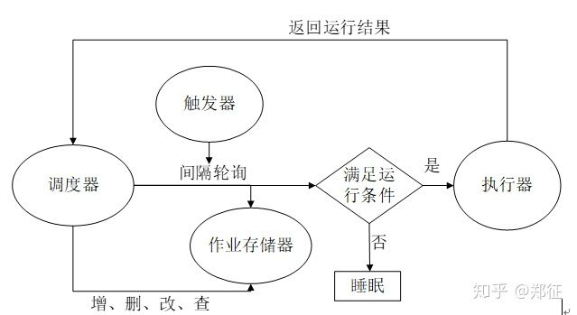

[toc]

## APScheduler 浅析

-   基本组件
    -   **触发器**（trigger）

        >   -   [`date`](https://apscheduler.readthedocs.io/en/latest/modules/triggers/date.html#module-apscheduler.triggers.date): use when you want to run the job just once at a certain point of time
        >   -   [`interval`](https://apscheduler.readthedocs.io/en/latest/modules/triggers/interval.html#module-apscheduler.triggers.interval): use when you want to run the job at fixed intervals of time
        >   -   [`cron`](https://apscheduler.readthedocs.io/en/latest/modules/triggers/cron.html#module-apscheduler.triggers.cron): use when you want to run the job periodically at certain time(s) of day

    -   **作业存储器**（job stores）

        -   Memory（默认）
        -   [SQLAlchemy](http://www.sqlalchemy.org/) (any RDBMS supported by SQLAlchemy works)
        -   [MongoDB](http://www.mongodb.org/)
        -   [Redis](http://redis.io/)
        -   [RethinkDB](https://www.rethinkdb.com/)
        -   [ZooKeeper](https://zookeeper.apache.org/)

    -   **执行器**（executors）

        -   ThreadPoolExecutor: 默认
        -   ProcessPoolExecutor: CPU 密集型

    -   **调度器**（scheduler）/ 集成框架

        >   -   [`BlockingScheduler`](https://apscheduler.readthedocs.io/en/latest/modules/schedulers/blocking.html#apscheduler.schedulers.blocking.BlockingScheduler): use when the scheduler is the only thing running in your process
        >   -   [`BackgroundScheduler`](https://apscheduler.readthedocs.io/en/latest/modules/schedulers/background.html#apscheduler.schedulers.background.BackgroundScheduler): use when you’re not using any of the frameworks below, and want the scheduler to run in the background inside your application
        >   -   [`AsyncIOScheduler`](https://apscheduler.readthedocs.io/en/latest/modules/schedulers/asyncio.html#apscheduler.schedulers.asyncio.AsyncIOScheduler): use if your application uses the asyncio module
        >   -   [`GeventScheduler`](https://apscheduler.readthedocs.io/en/latest/modules/schedulers/gevent.html#apscheduler.schedulers.gevent.GeventScheduler): use if your application uses gevent
        >   -   [`TornadoScheduler`](https://apscheduler.readthedocs.io/en/latest/modules/schedulers/tornado.html#apscheduler.schedulers.tornado.TornadoScheduler): use if you’re building a Tornado application
        >   -   [`TwistedScheduler`](https://apscheduler.readthedocs.io/en/latest/modules/schedulers/twisted.html#apscheduler.schedulers.twisted.TwistedScheduler): use if you’re building a Twisted application
        >   -   `QtScheduler`: use if you’re building a Qt application

-   **工作流程**

    -   

-   使用（增、删、改、查、暂停、恢复、开始、关闭）

    -   https://apscheduler.readthedocs.io/en/latest/userguide.html

-   自定义（trigger、job stores、executors、schedulers）

    -   https://apscheduler.readthedocs.io/en/latest/extending.html#

-   参考
    -   [github](https://github.com/agronholm/apscheduler)
    -   [官方文档](https://apscheduler.readthedocs.io/en/latest/index.html)