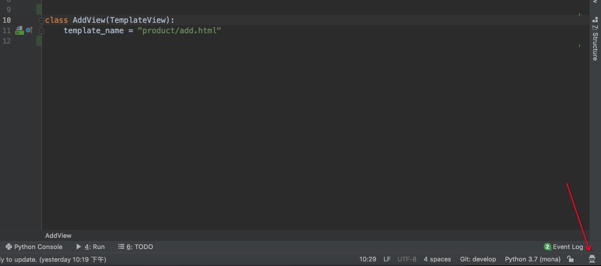
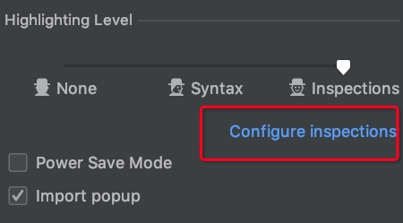
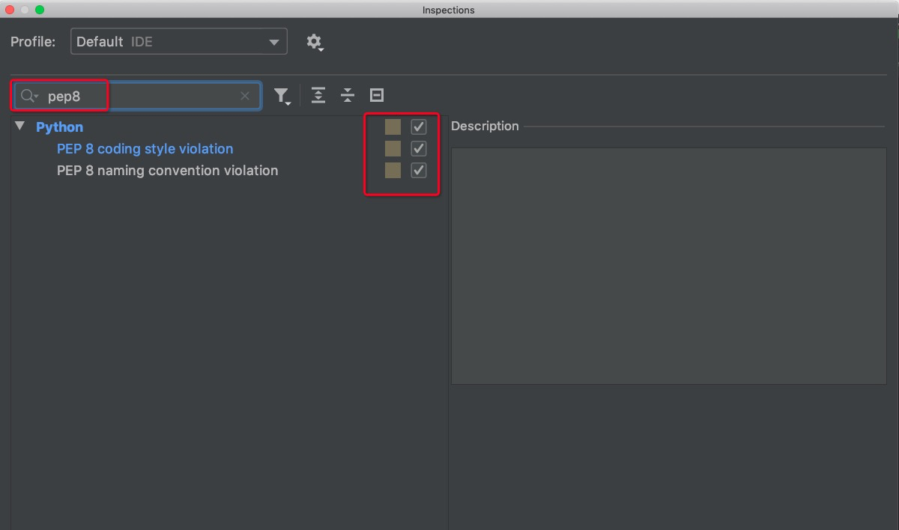
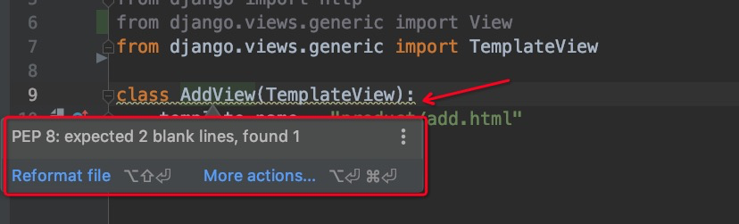

[toc]

## Pycharm PEP8 风格检查

### 问题

-   如何开启 Pycharm 自带的代码风格（PEP8）检查？

### 操作步骤

1.  点击 Editor 右下角，医生样式的图标。
    -   

2.  点击 Configure inspections。
    -   
3.  搜索 pep8，将相关检查项选中。
    -   
4.  点击右下角“保存”按钮。
5.  此时，可以观察到 Editor 窗口中会出现很多代码风格提示。我们可以根据相关提示做相应的修改。
    -   