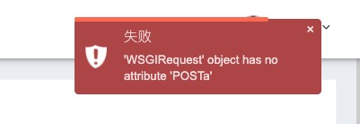

[toc]

## 如何使用 logger 正确输出异常信息

### 背景

1.  原代码如下

    -   ```python
        try:
            
            data = ServiceWfTemp.get_workflow(request)
            return self.render_to_response({"result": True, "data": data})
        
        except Exception as e:
            return self.render_to_response({"result": False, "message": str(e)})
        ```

2.  try 如捕获到异常，

    -   页面输出如下
	-   
    -   终端、logger 均无输出
    

### 优化

1.  在 except 里添加输出

####   方式一：字符串拼接

1.  代码

    -   ```python 
        logger.error("Error: {}".format(e))
        ```

2.  输出

    -    ```bash
         ERROR:apps.wf_temp.view:Error: 'WSGIRequest' object has no attribute 'POSTa'
         ```

####   方式二：使用 logger exc_info

1.  代码

    -   ```python
        logger.error("Error: ", exc_info=True)
        ```

2.  输出

    -   ```shell
        ERROR:apps.wf_temp.view:Error:
        Traceback (most recent call last):
        	File ".../view.py", line 127, in post
        		data = ServiceWfTemp.get_workflow(request)
        	File ".../wf_temp.py", line 218, in get_workflow
        		params = dict(request.POSTa)
        AttributeError: 'WSGIRequest' object has no attribute 'POSTa'
        ```

####   方式三：使用 logger.exception

1.  代码

    -   ```python
        logger.exception("Error: ")
        ```

2.  输出

    -   ```shell
        ERROR:apps.wf_temp.view:Error:
        Traceback (most recent call last):
        	File ".../view.py", line 127, in post
        		data = ServiceWfTemp.get_workflow(request)
        	File ".../wf_temp.py", line 218, in get_workflow
        		params = dict(request.POSTa)
        AttributeError: 'WSGIRequest' object has no attribute 'POSTa'
        ```

### 小结

1.  logger exc_info 和 exception 区别

    -   exc_info 明确日志级别 error，可读性更好。
    -   exception 可以少打几个代码。
    -   exception 就是在调用 logger exc_info。

2.  推荐

    -   异常日志输出一定要输出完整错误信息（python traceback/java stack trace）
    -   推荐使用 logger exc_info，可明确日志级别、输出位置。
    -   在代码效果一样的情况下，推荐使用 exc_info 方式。多写几个代码，能提高代码可读性是值得的。