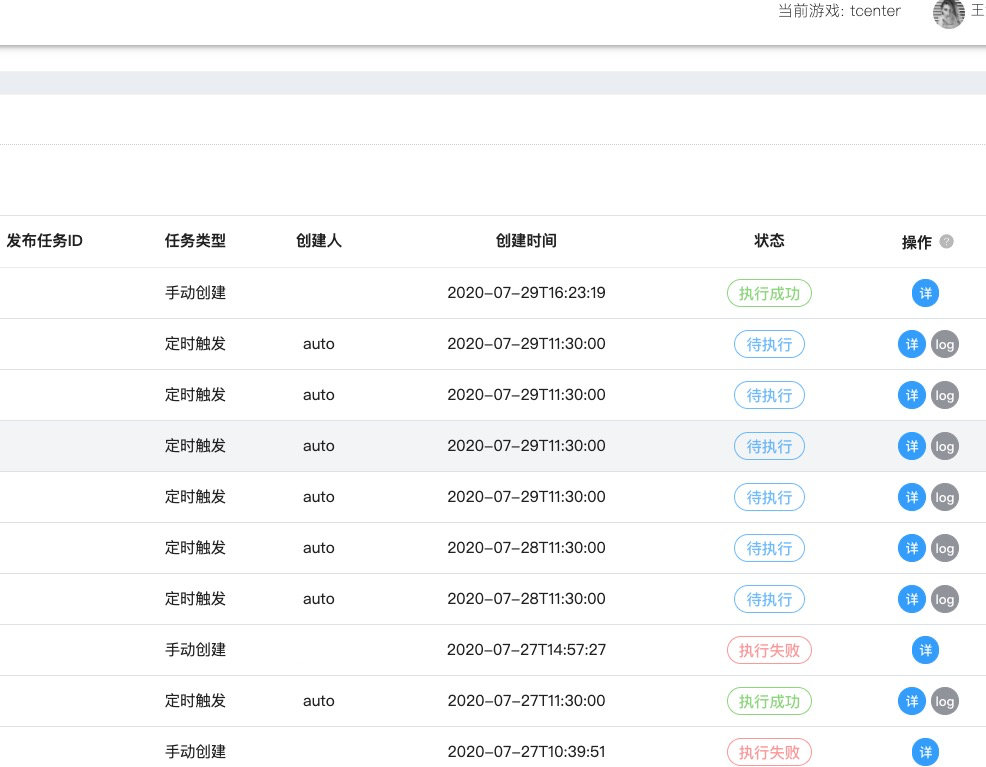

[toc]

## 深入理解 APScheduler

-   APscheduler 全称 Advanced Python Scheduler。
-   主要来用帮你完成一个**调度任务**。
-   之前一个分享 wiki:  [Python APScheduler 分享](http://gitlab.playcrab-inc.com/gaoyang/operation-document/-/wikis/Python-APScheduler-分享)

### 基础概念/组件

1.  **triggers** (触发器)
    -   触发器包含调度逻辑，每一个作业都有它自己的触发器，用于决定接下来哪一个作业会运行。无状态。
2.  **job stores**（存储器）
    -   存储被调度的作业。默认为内存。存储器不能被多个调度器共享。
3.  **executors** (执行器)
    -   处理运行中的作业（job）。通常将作业提交到线程或进程池。当作业完成后，执行器会通知（notifies）调度器，发一个事件（event）。
4.  **schedulers** (调度器)
    -   调度器负责将上述几个东西组合在一起。
    -   在你应用中只有一个调度器运行，应用通常不直接面对 triggers、job storesex 和 executors。
    -   调度器提供一些合适的接口。

### 工作流程图

1.  “网上得来终觉浅，绝知此图要亲自画”
2.  
3.  [查看原图](imgs/Apsheduler 工作流程图.pdf)

### 代码结构

1.  ```bash
    ./apscheduler/
    ├── __init__.py
    ├── events.py			# 事件封装类
    ├── job.py				# job 封装类
    ├── util.py				# 一些工具方法
    ├── executors			# 执行器
    │   ├── __init__.py
    │   ├── ...
    ├── jobstores			# 存储器
    │   ├── __init__.py
    │   ├── ...
    ├── schedulers			# 调度器
    │   ├── __init__.py
    │   ├── ...
    └── triggers			# 触发器
        ├── __init__.py
        ├── ...
    ```
    
2.  这儿就不继续深入了，了解了全局架构。后面再根据业务需求，针对性的去看相应的源码，就好了。

### 如何选择合适的 schedulers、executors、job stores、triggers ？

#### schedulers

1.  BlockingScheduler

    -   阻塞，当调度程序是唯一要运行的东西时使用。

    -   start

        -   ```python
                def start(self, *args, **kwargs):
                    self._event = Event()
                    super(BlockingScheduler, self).start(*args, **kwargs)
                    self._main_loop()
            ```

2.  BackgroundScheduler

    -   非阻塞/守护线程，当你不打算用如下的 Python 框架，并且希望调度程序在你的应用后台运行。

    -   start

        -   ```python
                def start(self, *args, **kwargs):
                    self._event = Event()
                    BaseScheduler.start(self, *args, **kwargs)
                    self._thread = Thread(target=self._main_loop, name='APScheduler')
                    self._thread.daemon = self._daemon
                    self._thread.start()
            ```

3.  AsyncIOScheduler

    -   use if your application uses the asyncio module

4.  GeventScheduler

    -   use if your application uses gevent

    -   start

        -   ```python
                def start(self, *args, **kwargs):
                    self._event = Event()
                    BaseScheduler.start(self, *args, **kwargs)
                    self._greenlet = gevent.spawn(self._main_loop)
                    return self._greenlet
            ```

5.  TornadoScheduler

    -   use if you’re building a Tornado application

6.  TwistedScheduler

    -   use if you’re building a Twisted application

7.  QtScheduler

    -   use if you’re building a Qt application

#### executors

1.  **ThreadPoolExecutor**

    -   在一个线程池中运行 job。

    -   主要方法：

        -   start：

            -   简单的初始化工作。

            -   ```python
                    def start(self, scheduler, alias):
                        
                        self._scheduler = scheduler
                        self._lock = scheduler._create_lock()
                        self._logger = logging.getLogger('apscheduler.executors.%s' % alias)
                
                ```

        -   shutdown：

            -   停止 executor。会被不同 executor 重载。 

        -   submit_job：

            -   job 提交，调用 `_do_submit_job`

            -   ```python
                self._do_submit_job(job, run_times)
                ```

        -   _do_submit_job：

            -   实际提交 run_job 到 executor。会被不同 executor 重载。 

            -   ```python
                f = self._pool.submit(run_job, job, job._jobstore_alias, run_times, self._logger.name)
                ```

        -   _run_job_success：

            -   成功回调

        -   _run_job_error：

            -   失败回调

-   **ProcessPoolExecutor**
    -   在一个进程池中运行 job。
-   DebugExecutor
    -   非正式使用，直接调用目标函数。阻塞式。
-   AsyncIOExecutor
-   GeventExecutor
-   TornadoExecutor
- TwistedExecutor

#### job stores

-   Memory（默认）
-   [SQLAlchemy](http://www.sqlalchemy.org/) (any RDBMS supported by SQLAlchemy works)
-   [MongoDB](http://www.mongodb.org/)
-   [Redis](http://redis.io/)
-   [RethinkDB](https://www.rethinkdb.com/)
-   [ZooKeeper](https://zookeeper.apache.org/)

#### triggers

1.  cron
    -   同 Linux crontab 风格
2.  interval
    -   指定固定时间间隔
3.  date
    -   指定某一时间点调用

### 使用案例

1.  奏折定时任务

    -   

2.  问题

    -   描述
        -   由于奏折线上环境是多进程部署，所以 apscheduler 在解发时会存在**并发问题**。
        -   

3.  分析

    -   通过分析BlockingScheduler/BackgroundScheduler/AsyncIOScheduler/GeventScheduler ... 源码。

    -   得知，获取 job 主要是通过 `due_jobs = jobstore.get_due_jobs(now)`

    -   `get_due_jobs` 会被不同的 job stores 重载。如下是 sqlalchemy 源码（mongodb/redis 源码类似）：

        -   ```python
            
                def get_due_jobs(self, now):
                    timestamp = datetime_to_utc_timestamp(now)
                    return self._get_jobs(self.jobs_t.c.next_run_time <= timestamp)
            
                
                # 省略不必要的代码
                def _get_jobs(self, *conditions):
                    jobs = []
                    .....
            
                    for row in self.engine.execute(selectable):
                        try:
                            jobs.append(self._reconstitute_job(row.job_state))
                        except BaseException:
                            ......
                            
                    return jobs
            ```

    -   发现在 `get_due_jobs` 方法获取作业数据时，并没有做任何并发处理。所以它在并发环境下存在并发问题。

    -   后来发现，[官方 FAQ](https://apscheduler.readthedocs.io/en/stable/faq.html#how-do-i-share-a-single-job-store-among-one-or-more-worker-processes) 也对这个问题做了相应解释。

4.  解决方案

    -   使用最常见分布式锁（mysql/redis/zookeeper）来解决。

    -   多种分布式锁的中，我们选用了 redis。主要原因：

        -   易理解，实现简单。
        -   性能，操作内存。
        -   通过超时时间来避免死锁。

    -   源码

        -   ```python
            #!/usr/bin/env python
            # coding: utf-8
            # __author__ = 'wang tao'

            import redis
            from django.conf import settings

            __all__ = [
                "RedisLock",
            ]
    
            class RedisLock:
    
                def __init__(self, lock_key, expire_time=60):
    
                    redis_conf = settings.REDIS_DATABASES
    
                    self.redis = redis.Redis(
                        host=redis_conf.get("HOST"),
                        port=redis_conf.get("PORT"),
                        db=redis_conf.get("DB"),
                        password=redis_conf.get("PASSWORD")
                    )
                    self.lock_key = lock_key
                    self.expire_time = expire_time
    
                def acquire_lock(self):
    
                    res = self.redis.setnx(self.lock_key, 1)
                    if res:
                        # 设置超时时间，避免死锁
                        self.redis.expire(self.lock_key, self.expire_time)
                        return True
    
                    else:
                        return False
    
                def release_lock(self):
                    self.redis.close()
    
                def __enter__(self):
                    return self.acquire_lock()
    
                def __exit__(self, exc_type, exc_val, exc_tb):
                    self.release_lock()
             
            if __name__ == "__main__":
            
                # 调用
                with RedisLock("foo") as lock:
                    if lock:
                        print("Successful lock acquisition")
                        print("Doing some thing ...")
            
            ```


### 其他

1.  [Troubleshooting | 排错](https://apscheduler.readthedocs.io/en/stable/userguide.html#troubleshooting)
2.  [Frequently Asked Questions | 常见问答](https://apscheduler.readthedocs.io/en/stable/faq.html)
3.  [bug tracker | bug 追踪](https://github.com/agronholm/apscheduler/issues)
4.  [APScheduler Google group](http://groups.google.com/group/apscheduler)
5.  [StackOverflow](http://stackoverflow.com/questions/tagged/apscheduler)
6.  [Git Repo | 源码库](https://github.com/agronholm/apscheduler)
7.  [Extending | 扩展](https://apscheduler.readthedocs.io/en/stable/extending.html#extending-apscheduler)
8.  [API reference | API 文档](https://apscheduler.readthedocs.io/en/stable/py-modindex.html#)


