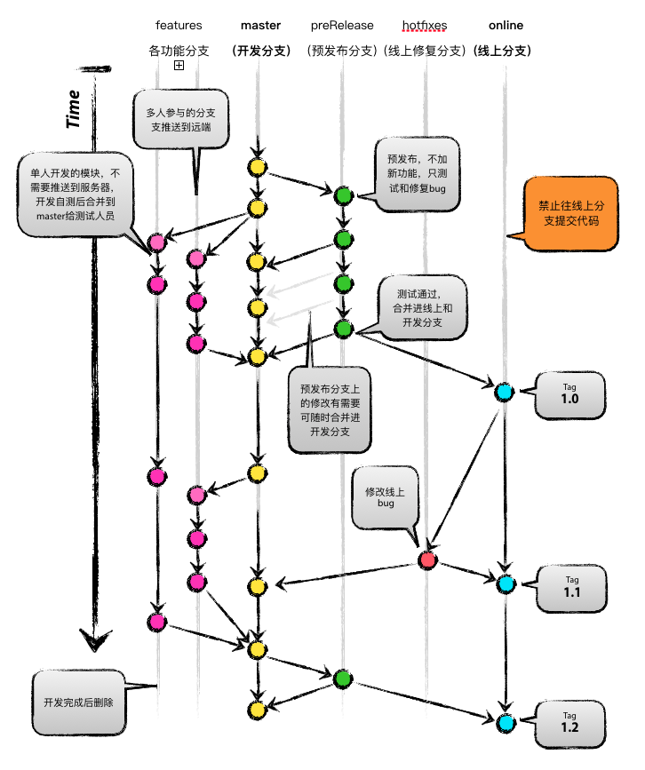

# Git分支管理

## 一、分支管理

### 1. 图例

-   

### 2. 长期分支

-   master：主开发分支
-   online：线上分支，根据具体运营情况，线上分支可能会有多个，比如iOS和Android版本不同步。不允许在此分支上提交代码。

### 3. 短期分支

-   功能开发分支：开发每个模块时从master切出，开发完成后删除。命名规则：feature_模块名，如feature_hero
    -   前期：开发完成后合并进master并进行测试。单人开发的模块无需推送到远端。
    -   上线后：测试在开发分支上进行，合并进master前必须确认排期，由测试来决定是否需要合并进master。
-   preRelease：预上线分支，功能封版准备上线时从master切出，在此分支上进行测试和bug修复。测试完成后合并进online和master分支，在online分支上打tag上线。
-   hotfix：线上修复bug分支，由online分支切出，修改完成后合并进online分支，在online分支上打tag上线。根据实际情况看是否合并进master分支。

## 二、Git使用规范

### 1. 代码提交

-   提供详细的提交说明

    -   如果是bug，需要标注：fix + 具体功能bug描述，有JIRA要提供JIRA号
    -   如果是优化，需要标注：具体功能+优化描述
    -   合并代码，需要标注：具体合并内容
    -   打tag，需要标注：此tag的具体用途

-   提交时如发现分支有更新，需要先用rebase同步，而不要用git pull，会产生额外的merge提交

    ```
    git fetch origin
    git rebase origin/[branch]
    ```

-   如果要提交的commit过多，可以考虑参考下面方法合并commit，不做强制要求。http://www.jianshu.com/p/964de879904a

### 2. 分支合并

-   功能开发分支
    -   功能分支由各自负责人员自行合并到主分支，如果出现冲突需要找对应模块的负责人一起解决。
    -   分支开发过程中可以经常使用rebase来同步主干，减少出现冲突的可能。
-   preRelease & hotfix
    -   上线相关分支的创建和代码合并由主程负责
    -   测试人员在preRelease和hotfix分支上测试，进行Checklist，通过后合并进online打tag上线
    -   tag由主程负责
-   如果不需要全部合并，则使用cherrypick命令来合并单独的commit，推荐使用sourcetree来操作

### 3. 图形客户端

-   推荐使用SourceTree
-   在每次提交之前，使用SourceTree看一下每个文件的改动做二次检查，并删掉无用的打印代码