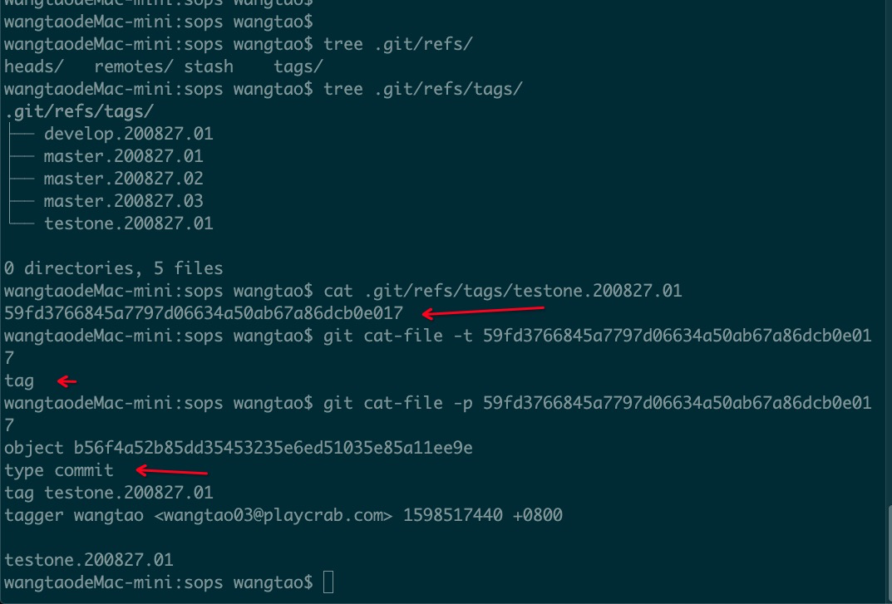

[toc]

## Git tag 存储分析

### 场景

-   ```tex
    A 分支： 
    	
    	commit: a -> b -> c  （从 c 点，打出最新 tag 为： A.200827.01）
    				 ^
    				 |
    
    
    B 分支：（从 “A 分支” 中，commit 号为 “b” 的点切出来 ）
    
    	commit： a -> b
    
    
    	1. 如果这时打 tag 为 A.200827.02（未按最新分支名打 tag），且自动打包规则配置为 "A"。	==>> 此时，获取最新 tag 为 A.200827.01
    
    	2. 如果这时打 tag 为 B.200827.01（根据最新分支名打 tag），且自动打包规则配置为 "B"。	==>> 此时，获取最新 tag 为 B.200827.01
    
    ```

### 结论

1.  如果遇到这种情况，tag 名、自动打包规则，按新分支名设置。

### 理论参考

1.  tag 跟 commit 挂钩，tag 本身没有记录时间
2.  

