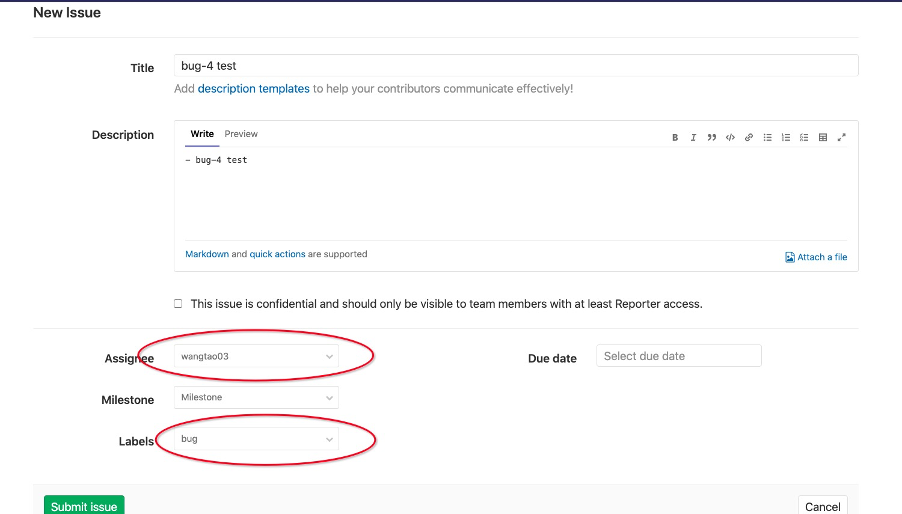
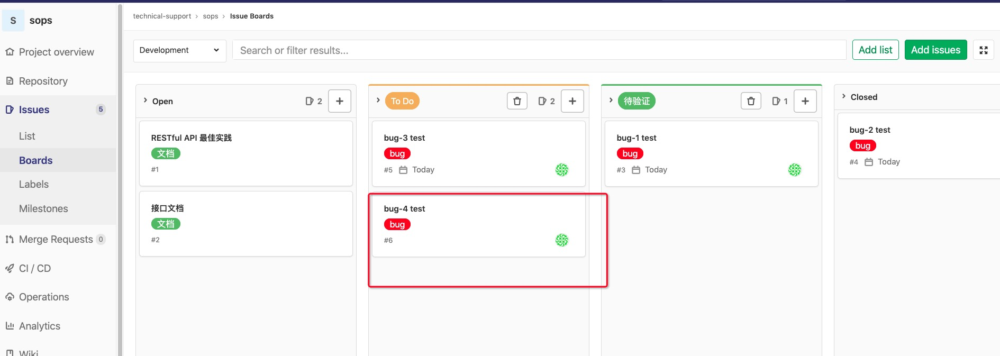
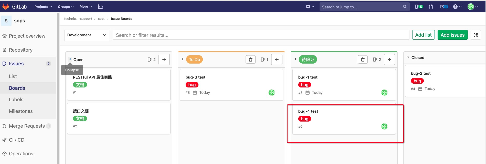
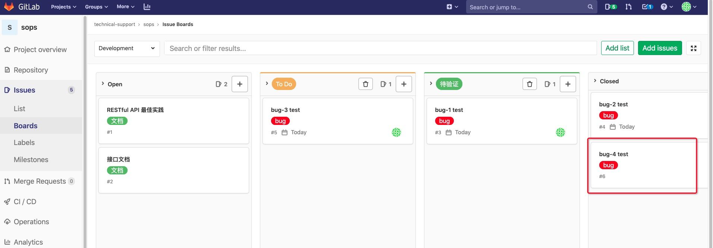

[toc]

## Bug 管理流程

1.  新建 issue

    -   

    -   Assignee：分配用户
    -   Labels：**初始 bug issue 的话，这里选 “bug” 和 “ToDo”** 

2.  查看新建 issue 的状态

    -   

3.  issus bug 修复完成

    -   将 issue 从 "To Do" 阶段移到 “待验证” 阶段。
    -   

4.  上线，回归测试

    -   代码上线，线上测试完成后，将 issue 从 “待验证” 移到 “closed” 阶段。
    -   

5.  至此，一个 bug issue 的整个生命周期结束。