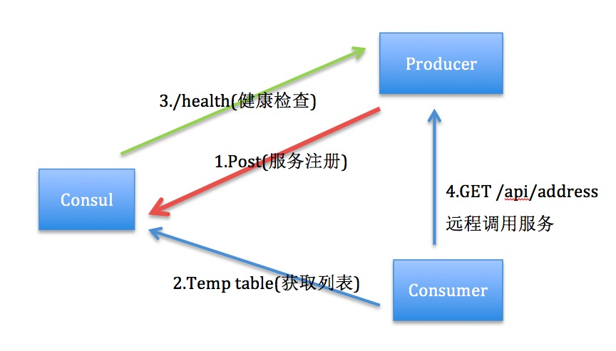
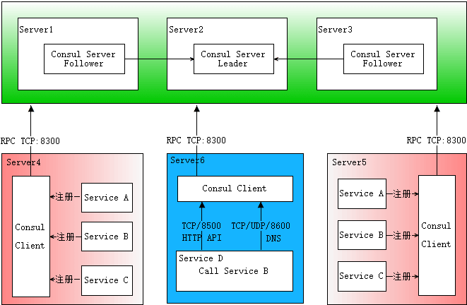
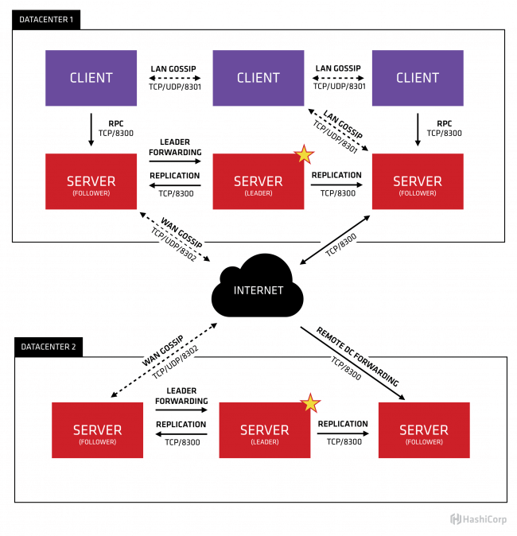
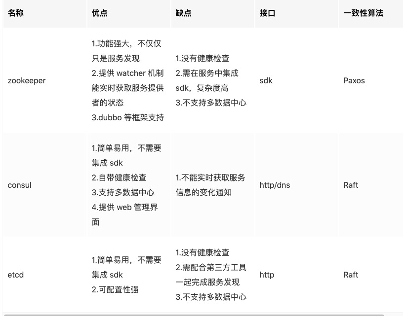

[toc]

## consul 简介

1.  简介：

    -   `Consul` 是 HashiCorp 公司推出的开源工具，用于实现分布式系统的服务发现与配置。
2.  特性：

    -   服务发现（主要功能）
    -	健康检测
    -	Key/Value 存储
    -	多数据中心
3.  适用场景

    -   简单的服务发现流程分解图

    -   
    -   较完整的服务发现流程分解图
    -   
4.  内部原理

    -   
5.  与其他常见服务发现框架对比
    -   
6.  python client 相关文档

    -   [Python client for Consul](https://python-consul.readthedocs.io/en/latest/)
    -   [Python client | Github](https://github.com/cablehead/python-consul)
    -   [使用 Consul 作为 Python 微服务的配置中心](https://juejin.cn/post/6844903797064466445#heading-0)

6.  参考：
    -   [使用 Consul 作为 Python 微服务的配置中心](https://juejin.cn/post/6844903797064466445#heading-0)
    -   [使用Consul做服务发现的若干姿势](https://blog.didispace.com/consul-service-discovery-exp/)
    -   [微服务Consul介绍](http://gitlab.playcrab-inc.com/technical-support/operation-document/-/wikis/Introduction-to-Consul)

